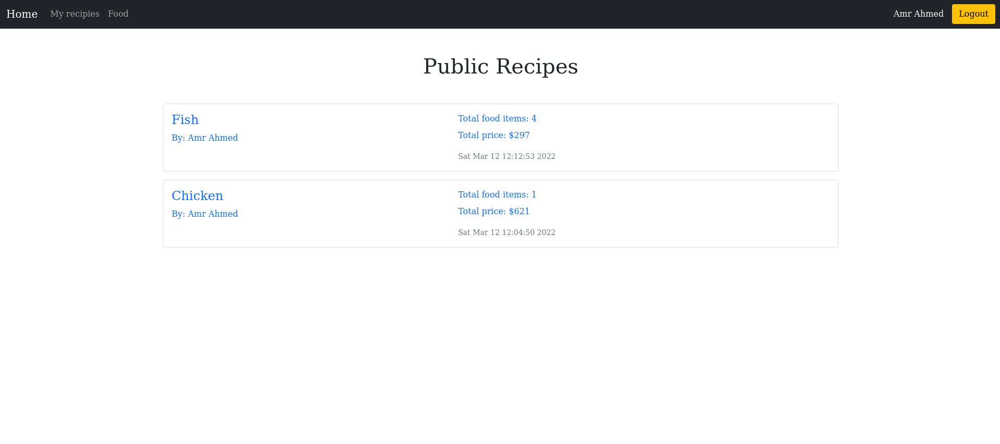

# Dish Recipes

> Dish Recipes



> The Recipe app keeps track of all your recipes, ingredients, and inventory. It will allow you to save ingredients, keep track of what you have, create recipes, and generate a shopping list based on what you have and what you are missing from a recipe. Also, since sharing recipes is an important part of cooking the app should allow you to make them public so anyone can access them.

## Built With

- Ruby on Rails
- Bootstrap

## Getting Started

To get a local copy up and running follow these simple example steps.

Simply click on `Code` drop down menu should appear then `download ZIP` after extraction you could follow `Usage` step

### Prerequisites

`gems`
`ruby`
`postgres`

### Setup

###### Do this step if you didn't download as ZIP, if you did, skip to next step please

to setup the project on your local, run these commands

```shell
git clone https://github.com/Amrhub/dish-recipes

cd dish-recipes  // to open the project
```

### Install

```shell
    bundle install # install dependencies
```

### Usage

To make sure project works as expected create instance file from `config/application_example.yml` with name "application.yml" with required data in application_example.

```shell
    rails db:create # create database
    rails db:migrate # migrate tables
    # or use rails db:schema:load instead of previous commands but it will depend on latest version of schema.rb when running

    rails s # start local host
    rails c # to start rails console
```

### Tests

```shell
rspec # Run all tests
rspec spec/models # run tests for only models
```

## Authors

👤 **Leo de Andrade**

- GitHub: [@leodeandrade13](https://github.com/Leonardoeng13)
- LinkedIn: [Leonardo de Andrade](https://www.linkedin.com/in/leonardodeandrade/)
- Twitter: [Leo de Andrade](https://twitter.com/andrede_leo)

👤 **Amr Ahmed**

- GitHub: [@Amrhub](https://github.com/Amrhub)
- LinkedIn: [Amr Ahmed](https://linkedin.com/in/amr-abdelrehim-ahmed)

## 🤝 Contributing

Contributions, issues, and feature requests are welcome!

Feel free to check the [issues page](../../issues/).

## Show your support

Give a ⭐️ if you like this project!

## 📝 License

This project is [MIT](./MIT.md) licensed.
